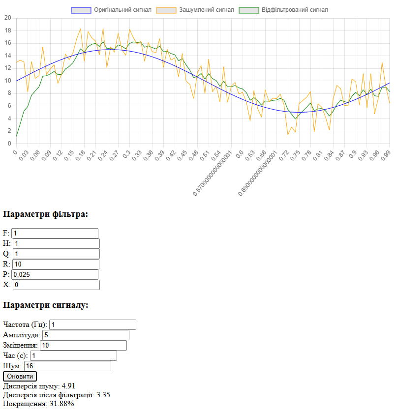

# Звіт з лабораторної роботи №7
## Дослідження фільтра Калмана

### Мета роботи
- Дослідити вплив різних параметрів фільтра Калмана на якість фільтрації сигналу
- Проаналізувати зміни дисперсії шуму до та після фільтрації
- Визначити оптимальні параметри фільтра для різних умов роботи

### Дослідження параметрів фільтра Калмана

**Початковий стан системи**

Даний графік демонструє роботу фільтра Калмана з базовими параметрами:
- F = 1.0, H = 1.0, Q = 1.0, R = 10.0, P = 1.0 
- Початковий стан: x = 0

**1. Вплив параметрів F та H**

При малому значенні F = 0.25 фільтр демонструє дуже повільну реакцію на зміни сигналу.

При великому значенні F = 15.0 фільтр реагує швидко, але його робота стає менш стабільною.

Коли H = 0.2, фільтр слабко пов'язаний з вхідними даними, що призводить до низької реакції на зміни.

При H = 7.5 фільтр сильно залежить від вхідних даних, що знижує його стабільність.

**2. Вплив ковариації шуму процесу (Q)**

Мале значення Q = 0.025 забезпечує максимально плавну фільтрацію, але знижує реакцію на зміни сигналу.

Велике значення Q = 75.0 дозволяє фільтру швидко реагувати на зміни, але погіршує фільтрацію шуму.

**3. Вплив ковариації шуму вимірювань (R)**

Мале значення R = 0.25 призводить до того, що фільтр майже повністю слідує за вхідними вимірами.

Велике значення R = 150.0 забезпечує високу стабільність роботи фільтра, але знижує його реакцію на зміни.

**4. Вплив початкової ковариації (P)**

Мале значення P = 0.025 призводить до повільної початкової збіжності фільтра.

**5. Вплив початкового стану**

Коли початковий стан x = 25.0, система демонструє значне початкове відхилення.

Коли початковий стан x = 10.0, фільтр швидко та точно підлаштовується під реальний сигнал.

**6. Вплив зміщення сигналу**

При зміщенні сигналу на 35.0 фільтр стабільно відслідковує сигнал.

При зміщенні на -15.0 система коректно адаптується до нового рівня.

**7. Вплив часу моделювання**

При часі моделювання 0.75с отримуємо базову оцінку роботи фільтра.

При збільшенні часу моделювання до 7.5с підтверджується стабільність роботи фільтра.

### Висновки

В ході дослідження фільтра Калмана було визначено, що найбільш критичними параметрами є F, R та Q. Їх оптимальні значення залежать від конкретного застосування:

Для стабільних систем: малі значення F і Q, великі значення R
Для динамічних систем: великі значення F і Q, малі значення R

Фільтр показав високу ефективність у зменшенні шуму при правильному налаштуванні параметрів. При цьому важливо забезпечити достатній час моделювання для стабілізації роботи фільтра та враховувати рівень шуму при виборі параметрів.
