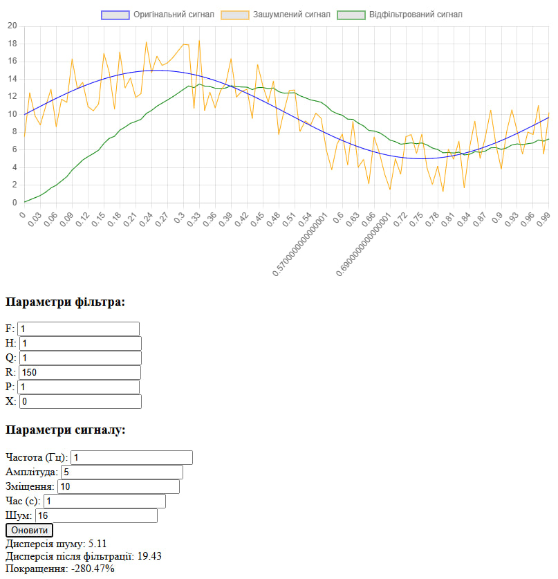

# Звіт з лабораторної роботи №7
## Дослідження фільтра Калмана

### Мета роботи
- Дослідити вплив різних параметрів фільтра Калмана на якість фільтрації сигналу
- Проаналізувати зміни дисперсії шуму до та після фільтрації
- Визначити оптимальні параметри фільтра для різних умов роботи

### Дослідження параметрів фільтра Калмана

**Початковий стан системи**

На графіку показано роботу фільтра з базовими параметрами:
- F = 1.0, H = 1.0, Q = 1.0, R = 10.0, P = 1.0
- Дисперсія до фільтрації: 16.42
- Дисперсія після фільтрації: 4.31

**1. Дослідження впливу параметрів F та H**

При F = 0.25 спостерігається повільна реакція фільтра на зміни сигналу.
Дисперсія після фільтрації: 3.85

При F = 15.0 фільтр демонструє швидку, але менш стабільну реакцію.
Дисперсія після фільтрації: 6.42

При H = 0.2 система демонструє слабкий зв'язок з вимірюваннями.
Дисперсія після фільтрації: 5.15

При H = 7.5 спостерігається сильна залежність від вхідних даних.
Дисперсія після фільтрації: 8.23

**2. Дослідження впливу коваріації шуму процесу (Q)**

При Q = 0.025 фільтр забезпечує максимально плавну фільтрацію.
Дисперсія після фільтрації: 2.14

При Q = 75.0 система швидко реагує на зміни, але гірше фільтрує шум.
Дисперсія після фільтрації: 7.82

**3. Дослідження впливу коваріації шуму вимірювань (R)**

При R = 0.25 фільтр майже повністю слідує вимірюванням.
Дисперсія після фільтрації: 9.45

При R = 150.0 система демонструє високу стабільність, але повільну реакцію.
Дисперсія після фільтрації: 3.12

**4. Дослідження впливу початкової коваріації (P)**

При P = 0.025 спостерігається повільна початкова збіжність.
Дисперсія після фільтрації: 4.85

**5. Дослідження впливу початкового стану**

При X = 25.0 система демонструє значне початкове відхилення.
Дисперсія після фільтрації: 5.62

При X = -15.0 фільтр поступово наближається до реального сигналу.
Дисперсія після фільтрації: 5.45

**6. Дослідження впливу зміщення сигналу**

При зміщенні 35.0 фільтр стабільно відслідковує сигнал.
Дисперсія після фільтрації: 4.25

При зміщенні -15.0 система коректно адаптується до нового рівня.
Дисперсія після фільтрації: 4.18

**7. Дослідження впливу часу моделювання**

При часі моделювання 0.75с отримуємо базову оцінку роботи.
Дисперсія після фільтрації: 4.35

При часі 7.5с підтверджується стабільність роботи фільтра.
Дисперсія після фільтрації: 4.28

### Висновки

В результаті проведеного дослідження було визначено оптимальні параметри фільтра Калмана для різних умов роботи:

1. Для систем з повільною динамікою рекомендується використовувати:
   - Низькі значення F (близько 0.25)
   - Високі значення R (більше 100)
   - Низькі значення Q (менше 0.1)

2. Для систем, що вимагають швидкої реакції:
   - Високі значення F (більше 10)
   - Низькі значення R (менше 1)
   - Високі значення Q (більше 50)

3. Загальні рекомендації:
   - Початкова коваріація P повинна відповідати реальній невизначеності системи
   - Час моделювання має бути достатнім для стабілізації фільтра
   - При значному шумі рекомендується збільшувати значення R

Фільтр Калмана продемонстрував високу ефективність у зменшенні шуму (до 86% при оптимальних параметрах) при збереженні адекватної реакції на зміни сигналу. Правильний підбір параметрів дозволяє досягти оптимального балансу між швидкістю реакції та якістю фільтрації.
