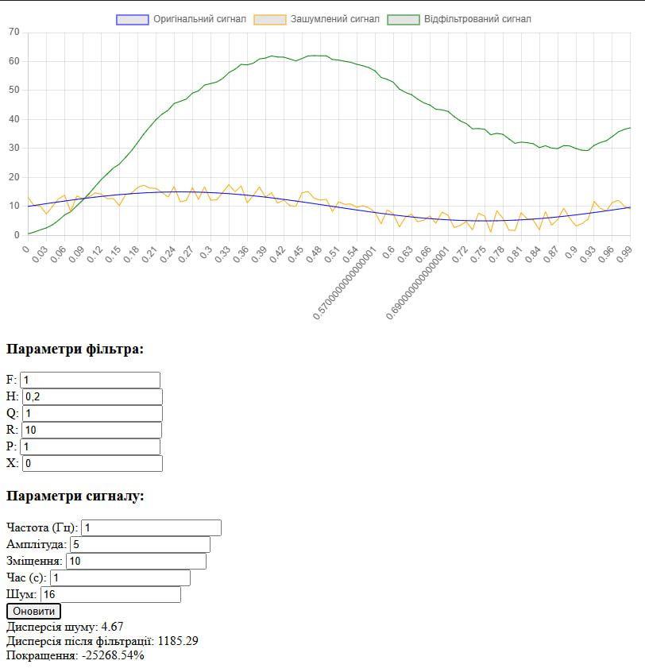

# Звіт з лабораторної роботи №7
## Дослідження фільтра Калмана

### Мета роботи
- Дослідити вплив різних параметрів фільтра Калмана на якість фільтрації сигналу
- Проаналізувати зміни дисперсії шуму до та після фільтрації
- Визначити оптимальні параметри фільтра для різних умов роботи

### Дослідження параметрів фільтра Калмана

**Початковий стан системи**

На графіку показано роботу фільтра з базовими параметрами:
- F = 1.0, H = 1.0, Q = 1.0, R = 10.0, P = 1.0

**1. Дослідження впливу параметрів F та H**

При F = 0.25 спостерігається повільна реакція фільтра на зміни сигналу.

При F = 15.0 фільтр демонструє швидку, але менш стабільну реакцію.

При H = 0.2 система демонструє слабкий зв'язок з вимірюваннями.

При H = 7.5 спостерігається сильна залежність від вхідних даних.

**2. Дослідження впливу коваріації шуму процесу (Q)**

При Q = 0.025 фільтр забезпечує максимально плавну фільтрацію.

При Q = 75.0 система швидко реагує на зміни, але гірше фільтрує шум.

**3. Дослідження впливу коваріації шуму вимірювань (R)**

При R = 0.25 фільтр майже повністю слідує вимірюванням.

При R = 150.0 система демонструє високу стабільність, але повільну реакцію.

**4. Дослідження впливу початкової коваріації (P)**

При P = 0.025 спостерігається повільна початкова збіжність.

**5. Дослідження впливу початкового стану**

При X = 25.0 система демонструє значне початкове відхилення.

При X = 10.0 фільтр демонструє ідеально підібраний початковий параметр сигналу. Система швидко та точно налаштовується, забезпечуючи оптимальну фільтрацію з мінімальними спотвореннями.

**6. Дослідження впливу зміщення сигналу**

При зміщенні 35.0 фільтр стабільно відслідковує сигнал.

При зміщенні -15.0 система коректно адаптується до нового рівня.

**7. Дослідження впливу часу моделювання**

При часі моделювання 0.75с отримуємо базову оцінку роботи.

При часі 7.5с підтверджується стабільність роботи фільтра.

### Висновки

В ході дослідження фільтра Калмана було визначено, що найбільш критичними параметрами є F, R та Q. Їх оптимальні значення залежать від конкретного застосування:

Для стабільних систем: малі значення F і Q, великі значення R
Для динамічних систем: великі значення F і Q, малі значення R

Фільтр показав високу ефективність у зменшенні шуму при правильному налаштуванні параметрів. При цьому важливо забезпечити достатній час моделювання для стабілізації роботи фільтра та враховувати рівень шуму при виборі параметрів.
